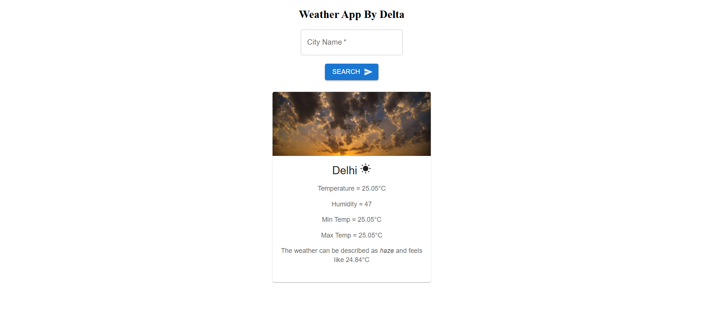
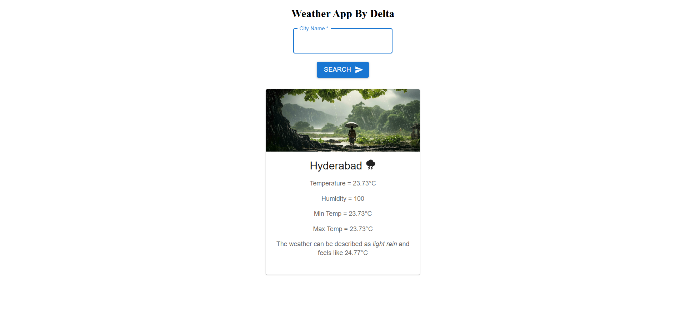

# **Forecast 360**

A simple and visually appealing React application that provides real-time weather updates for cities worldwide using the **OpenWeatherAPI**. Users can search for cities to check weather details, including temperature, humidity, and weather descriptions, along with a relevant image for the weather conditions.


## **Features**
- **Search Functionality**: Easily search for weather details of any city.
- **Real-Time Data**: Displays real-time temperature, humidity, and weather description.
- **Responsive Design**: User-friendly interface suitable for all devices.
- **Weather Visualization**: Includes weather images matching current conditions.


## **Technologies Used**
- **ReactJS**: Front-end framework.
- **OpenWeatherAPI**: Fetches weather data.
- **CSS**: Styling for the application.


## **Setup Instructions**

### **Prerequisites**
1. **Node.js**: Ensure Node.js and npm (Node Package Manager) are installed.  
   - Check installation:
     ```bash
     node -v
     npm -v
     ```
   - [Download Node.js here](https://nodejs.org/).

2. **Git**: Make sure Git is installed for cloning the repository.
   - Check installation:
     ```bash
     git --version
     ```
   - [Download Git here](https://git-scm.com/).


### **Installation Steps**
Follow these steps to clone and run the application:

1. **Clone the Repository**:
   ```bash
   git clone https://github.com/ashmita129/Forecast360
   ```

2. **Navigate to the Project Directory**
   ```bash
   cd weather-dashboard
   ```

3. **Install Dependencies**
   ```bash
   npm install
   ```

4. **Run the Application**
   ```bash
   npm run dev
   ```


## **API Key Configuration**
To access the **OpenWeatherAPI**, follow these steps:

### **Get an API Key**:
1. Visit [OpenWeatherAPI](https://openweathermap.org/api) and sign up for a free account.
2. Obtain your API key from the dashboard.

### **Add the API Key**:
1. Create a `.env` file in the project root directory.
2. Add the following line to the `.env` file:
   ```env
   API_KEY=your_openweather_api_key
   ```
3. Replace your_openweather_api_key with your actual API key.


### **Restart the Server**
```bash
npm run dev
```

## **Usage**
1. **Enter a city name in the search bar.**
2. **Click "Search" to fetch the weather details.**
3. **View the city's temperature, humidity, weather description, and an image representing the weather conditions.**


## **Sample Output**
### **Example Weather Data for Switzerland**
```mathematica
Temperature = -1.74°C  
Humidity = 85  
Min Temp = -2.27°C  
Max Temp = -1.25°C  
Weather = Broken clouds, feels like -3.67°C  
```


## **Sample Pics**

   

   

   

   
